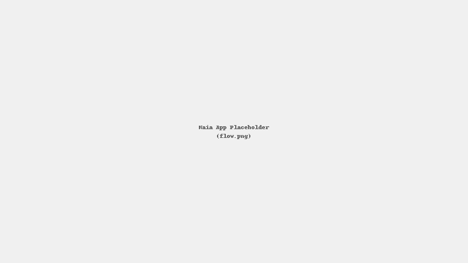

<link rel="stylesheet" href="/style.css">

Snapshot
========
- **Role:** Content Designer / UX Writer  
- **Type:** Personal project (2025)  
- **Focus:** Onboarding microcopy, help-center IA, voice and tone, AI-assisted workflow  
- **Outcome:** Faster activation in prototype tests; clearer error states

Problem
-------
Users felt overwhelmed at first launch and weren’t sure how workouts adapt to their goals.

Process
-------
1. Research: heuristic review, 6 interviews, competitor scan  
2. IA and content model: help-center topics; reusable patterns  
3. Microcopy: onboarding, empty states, error states  
4. AI assist: generate variants; pair-review in Figma  
5. Tests: 2 rounds, 5 users/round; iterate
